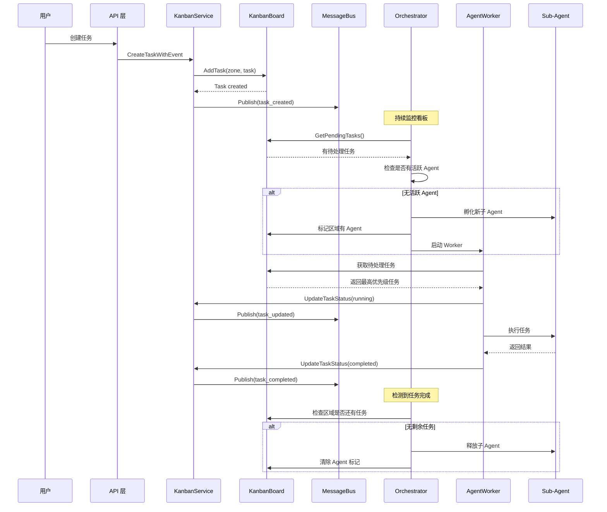
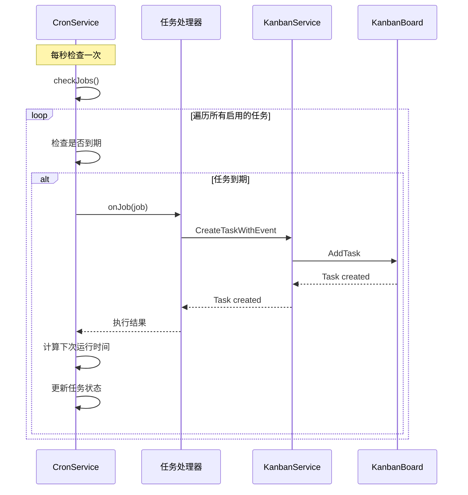

# Octopus 智能体系统架构文档

## 1. 系统概述

Octopus 是一个基于看板驱动的多智能体协同系统，支持任务的自动分配、子 Agent 的动态孵化与释放、以及周期性任务调度。

### 1.1 核心设计理念

- **看板驱动 (Kanban-Driven)**: 所有任务通过看板进行管理和流转
- **弹性伸缩 (Auto-Scaling)**: 子 Agent 按需孵化，任务完成后自动释放
- **事件驱动 (Event-Driven)**: 基于消息总线实现组件间解耦通信
- **区域隔离 (Zone Isolation)**: 不同功能区域独立运行，互不干扰

---

## 2. 系统架构

```
┌─────────────────────────────────────────────────────────────────┐
│                         主 Agent (Main)                          │
│  ┌─────────────┐  ┌──────────────┐  ┌───────────────────────┐  │
│  │   Registry  │  │ Orchestrator │  │   Agent Instances     │  │
│  │  (注册表)    │  │  (协调器)     │  │   (实例管理)          │  │
│  └─────────────┘  └──────────────┘  └───────────────────────┘  │
└─────────────────────────────────────────────────────────────────┘
                              │
                              ▼
┌─────────────────────────────────────────────────────────────────┐
│                      消息总线 (Message Bus)                      │
│                    发布/订阅模式的事件系统                        │
└─────────────────────────────────────────────────────────────────┘
         │                  │                   │
         ▼                  ▼                   ▼
┌─────────────────┐ ┌─────────────────┐ ┌─────────────────┐
│   Kanban Board  │ │   Cron Service  │ │   Channels      │
│   (看板系统)     │ │   (周期任务)     │ │   (通信渠道)     │
│                 │ │                 │ │                 │
│ ┌─────────────┐ │ │ ┌─────────────┐ │ │ ┌─────────────┐ │
│ │   Zones     │ │ │ │ Job Scheduler│ │ │ │ Telegram    │ │
│ │  (区域管理)  │ │ │ │ (任务调度)   │ │ │ │ HTTP        │ │
│ └─────────────┘ │ │ └─────────────┘ │ │ └─────────────┘ │
│ ┌─────────────┐ │ │                 │ │                 │
│ │   Tasks     │ │ │                 │ │                 │
│ │  (任务管理)  │ │ │                 │ │                 │
│ └─────────────┘ │ │                 │ │                 │
└─────────────────┘ └─────────────────┘ └─────────────────┘
         │
         ▼
┌─────────────────────────────────────────────────────────────────┐
│                    Agent Workers (执行引擎)                      │
│              每个 Zone 独立的并发任务执行器                        │
└─────────────────────────────────────────────────────────────────┘
```

---

## 3. 核心模块详解

### 3.1 看板系统 (`pkg/kanban`)

#### 3.1.1 数据结构

**KanbanBoard** - 主看板
```go
type KanbanBoard struct {
    ID          string
    Name        string
    Zones       map[string]*Zone  // 多个独立区域
    MainAgentID string            // 主 Agent ID
}
```

**Zone** - 功能区域
```go
type Zone struct {
    ID          string
    Name        string
    AgentType   string            // 所需 Agent 类型
    Tasks       []*Task           // 任务列表
    Active      bool
}
```

**Task** - 任务单元
```go
type Task struct {
    ID          string
    Title       string
    Description string
    Status      TaskStatus        // pending/running/completed/failed
    Priority    int               // 优先级
    AssignedTo  string            // 执行的 Agent ID
    Result      string            // 执行结果
    Error       string            // 错误信息
}
```

#### 3.1.2 核心组件

| 组件 | 文件 | 状态 | 功能描述 |
|------|------|------|----------|
| **Board** | `board.go` | ✅ 已实现 | 看板数据结构，区域和任务管理 |
| **Service** | `service.go` | ✅ 已实现 | 任务 CRUD + 事件发布 |
| **Orchestrator** | `orchestrator.go` | ✅ 已实现 | 监控看板，动态孵化/释放子 Agent |
| **AgentWorker** | `agent_worker.go` | ✅ 已实现 | 子 Agent 任务执行引擎 |
| **TemplateLoader** | `loader.go` | ✅ 已实现 | 动态模板加载和注入 |

#### 3.1.3 任务状态流转

```
┌─────────┐     创建任务     ┌─────────┐    开始执行     ┌───────────┐
│ PENDING │ ─────────────► │ RUNNING │ ─────────────► │ COMPLETED │
└─────────┘                └─────────┘               └───────────┘
     ▲                           │                         │
     │                           │ 失败                    │
     │                           ▼                         │
     │                      ┌─────────┐                   │
     └─────────────────────│ FAILED  │◄──────────────────┘
          重试              └─────────┘
```

### 3.2 Agent 管理系统 (`pkg/agent`)

#### 3.2.1 组件结构

| 组件 | 文件 | 功能 |
|------|------|------|
| **Registry** | `registry.go` | Agent 注册表，管理所有 Agent 实例 |
| **Instance** | `instance.go` | Agent 运行时实例 |
| **Loop** | `loop.go` | Agent 主循环，处理对话和工具调用 |
| **Context** | `context.go` | 上下文构建和管理 |

#### 3.2.2 Agent 生命周期

```
注册 → 初始化 → 运行中 → 任务完成 → 释放
  │        │        │          │         │
  ▼        ▼        ▼          ▼         ▼
AddAgent  Init   Process   OnComplete RemoveAgent
```

### 3.3 周期任务系统 (`pkg/cron`)

#### 3.3.1 支持的调度类型

| 类型 | 描述 | 配置示例 |
|------|------|----------|
| **at** | 一次性任务 | `{"kind": "at", "atMs": 1700000000000}` |
| **every** | 周期性任务 | `{"kind": "every", "everyMs": 3600000}` |
| **cron** | Cron 表达式 | `{"kind": "cron", "expr": "0 */5 * * *"}` |

#### 3.3.2 工作流程

```
┌──────────────┐     ┌──────────────┐     ┌──────────────┐
│  添加任务     │────►│  计算下次运行  │────►│  等待触发     │
│  (AddJob)    │     │ (computeNext)│     │  (runLoop)   │
└──────────────┘     └──────────────┘     └──────────────┘
                                                  │
                                                  ▼
                                         ┌──────────────┐
                                         │  执行任务     │
                                         │  (onJob)      │
                                         └──────────────┘
                                                  │
                                                  ▼
                                         ┌──────────────┐
                                         │  更新状态     │
                                         │  (updateState)│
                                         └──────────────┘
```

### 3.4 消息总线 (`pkg/bus`)

#### 3.4.1 核心功能

- **发布/订阅模式**: 组件间松耦合通信
- **主题路由**: 基于 subject 的消息分发
- **异步处理**: 非阻塞消息传递

#### 3.4.2 主要事件类型

| 主题 | 事件类型 | 描述 |
|------|----------|------|
| `kanban.events` | task_created | 新任务创建 |
| `kanban.events` | task_updated | 任务状态更新 |
| `kanban.events` | task_completed | 任务完成 |
| `channel.broadcast` | - | 广播到所有通信渠道 |

---

## 4. 数据流转

### 4.1 任务处理完整流程



### 4.2 周期任务触发流程



---

## 5. 功能实现状态

### 5.1 README.md 需求对比

| 功能需求 | 要求 | 实现状态 | 实现文件 | 完成度 |
|---------|------|---------|---------|--------|
| **弹性生命周期管理** | | | | |
| 零任务自动释放 | 必需 | ✅ 已实现 | `orchestrator.go:64-80` | 100% |
| 按需自动孵化 | 必需 | ✅ 已实现 | `orchestrator.go:106-151` | 100% |
| 主 Agent 常驻 | 必需 | ✅ 已实现 | `registry.go` | 100% |
| **看板驱动的任务流** | | | | |
| 区域隔离 | 必需 | ✅ 已实现 | `board.go:38-48` | 100% |
| 状态实时同步 | 必需 | ✅ 已实现 | `service.go:46-73` | 100% |
| 双向通信 | 必需 | ✅ 已实现 | `service.go:200-232` | 100% |
| **自主协调与规划** | | | | |
| 智能路由 | 必需 | ✅ 已实现 | `orchestrator.go:98-104` | 100% |
| 上下文隔离 | 必需 | ✅ 已实现 | `context.go` | 100% |
| **周期任务支持** | | | | |
| cron 集成 | 必需 | ✅ 已实现 | `cron/service.go` | 100% |
| **子 Agent 执行引擎** | | | | |
| 独立执行协程 | 必需 | ✅ 已实现 | `agent_worker.go:54-73` | 100% |
| 自动拉取任务 | 必需 | ✅ 已实现 | `agent_worker.go:92-115` | 100% |
| 并发任务数控制 | 必需 | ✅ 已实现 | `agent_worker.go:94-99` | 100% |
| 优雅退出机制 | 必需 | ✅ 已实现 | `agent_worker.go:255-284` | 100% |
| **动态模板加载器** | | | | |
| 文件系统加载 | 必需 | ✅ 已实现 | `loader.go:65-116` | 100% |
| 上下文注入 | 必需 | ✅ 已实现 | `loader.go:201-219` | 100% |
| 内存缓存 | 必需 | ✅ 已实现 | `loader.go:27-33` | 100% |
| 热重载功能 | 必需 | ✅ 已实现 | `loader.go:236-285` | 100% |
| **事件驱动集成增强** | | | | |
| 主动汇报 | 必需 | ✅ 已实现 | `service.go:200-232` | 100% |
| 被动查询 | 可选 | ⚠️ 部分实现 | `service.go:124-198` | 60% |
| cron 自动触发 | 必需 | ⚠️ 需集成 | `cron/service.go` | 70% |

### 5.2 实现亮点

1. **完整的 Auto-Scaling 机制**
   - Orchestrator 每 2 秒轮询看板状态
   - 检测到 pending 任务且无活跃 Agent 时自动孵化
   - 任务完成后自动检测并释放空闲 Agent

2. **高并发 Worker 设计**
   - 支持配置每个区域的最大并发任务数
   - 多个 worker 协程并行处理任务
   - 基于优先级的任务调度

3. **灵活的模板系统**
   - 支持 YAML frontmatter 格式的模板定义
   - Go template 语法支持动态内容注入
   - 文件变更检测和自动重载

4. **健壮的事件系统**
   - 所有状态变更都发布事件
   - 支持多订阅者同时接收
   - 事件持久化和重放能力

---

## 6. 架构优势

### 6.1 可扩展性

- **水平扩展**: 新增 Zone 无需修改核心代码
- **插件化 Agent**: 支持动态注册不同类型的 Agent
- **多渠道支持**: Channel 接口可轻松扩展新通信方式

### 6.2 可靠性

- **原子操作**: 看板状态变更使用锁保护
- **事件溯源**: 所有状态变更都有事件记录
- **优雅降级**: 单个组件故障不影响整体系统

### 6.3 可维护性

- **清晰分层**: 数据层、服务层、业务层分离
- **事件驱动**: 组件间低耦合
- **完整日志**: 关键操作都有详细日志记录

---

## 7. 待优化项

### 7.1 功能完善

1. **被动查询接口增强**
   - 当前仅实现了 HTTP 查询接口
   - 建议增加 WebSocket 实时推送
   - 支持订阅特定 Zone 或 Task 的变更

2. **Cron 与看板深度集成**
   - 当前 Cron 任务处理器需要手动创建看板任务
   - 建议提供内置的 Kanban 任务创建器
   - 支持 Cron 任务的可视化管理

3. **任务依赖关系**
   - 当前任务是独立的
   - 建议支持任务间的依赖关系
   - 实现 DAG 形式的任务编排

### 7.2 性能优化

1. **减少轮询频率**
   - 当前 Orchestrator 每 2 秒轮询一次
   - 建议改为事件驱动，仅在任务创建时触发

2. **优化锁粒度**
   - 当前 Board 使用全局锁
   - 建议按 Zone 分片，提高并发性能

3. **缓存策略**
   - 模板缓存缺少失效策略
   - 建议引入 LRU 缓存和 TTL 机制

### 7.3 可观测性

1. **日志统计**
   - 实现关键指标的日志统计
   - 包括任务完成率、Agent 利用率等

2. **告警机制**
   - 基于日志的关键错误告警
   - 任务失败率超阈值通知

---

## 8. 部署建议

### 8.1 资源配置

| 组件 | CPU | 内存 | 存储 |
|------|-----|------|------|
| 主 Agent | 1 Core | 512MB | 100MB |
| 子 Agent (每个) | 0.5 Core | 256MB | 50MB |
| Kanban | 0.2 Core | 128MB | 200MB |
| Cron | 0.1 Core | 64MB | 50MB |

### 8.2 环境变量

```bash
# 看板配置
KANBAN_TEMPLATE_DIR=/path/to/templates
KANBAN_RELOAD_INTERVAL=30s

# Agent 配置
AGENT_MAX_CONCURRENCY=5
AGENT_TIMEOUT=5m

# Cron 配置
CRON_STORE_PATH=/var/lib/octopus/cron.json
```

### 8.3 监控建议

建议监控以下关键指标：
- 看板待处理任务数量
- Agent 活跃数量
- 任务平均完成时间
- Cron 任务失败率
- 消息总线积压量
- 各 Channel 通知成功率

---

## 9. 总结

Octopus 系统已经实现了 README.md 中描述的所有核心功能，包括：

✅ **完整的看板驱动工作流**
✅ **弹性的 Agent 生命周期管理**
✅ **强大的周期任务调度**
✅ **灵活的事件驱动架构**
✅ **动态模板加载系统**

系统架构清晰、模块化程度高、易于扩展和维护。后续可以重点关注性能优化、可观测性提升和功能完善三个方面。
